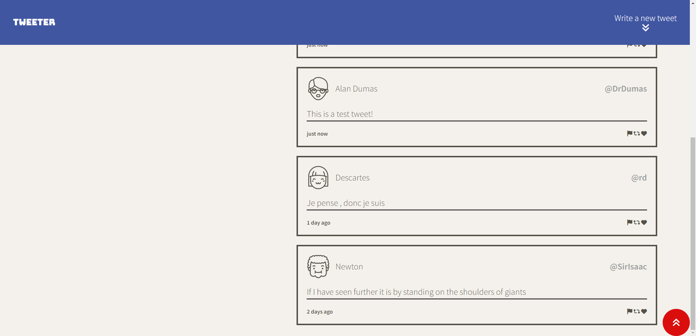
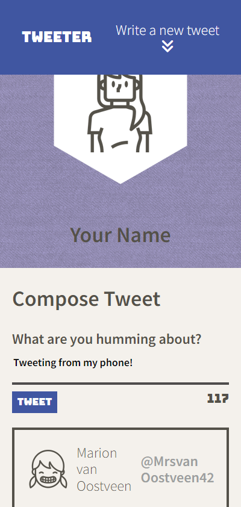

# Tweeter Project

Tweeter is a simple, single-page Twitter clone that allows the user to create tweets and view them in a compact but clean UI. Currently, tweets are stored in memory, so all new tweets will be deleted once the server stops. But this is a feature, as this project was created to practice HTML, CSS, JS, jQuery and AJAX front-end skills.

## Dependencies

- Node.js
- Express
- Body-Parser
- Chance
- md5
- Nodemon

## Getting Started

1. Download or clone the project (`git clone git@github.com:Yzma/tweeter.git`)
2. Navigate into the project directory and install all dependencies by running the `npm install` command in your terminal
3. Download and install Sass by running `npm install -g sass`
4. Build the Scss files by running `npm run build-css`
     - This will build our Scss files from `/scss` and place the newly built version into `/public/css`
5. `npm run start` to start the web server
6. Go to <http://localhost:8080/> in your browser.

## Screenshots

### Desktop View

#### Desktop Main Page

#### Desktop Create Tweet

#### Desktop Overview

#### Desktop Error State

### Mobile View

#### Mobile Main Page

#### Mobile Create Tweet

#### Mobile Overview

#### Mobile Error State

